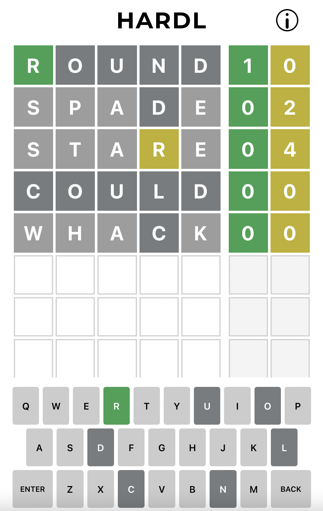

# HARDL

A harder version of the popular game Wordle inspired by Mastermind. Instead of revealing whether a letter is in the answer for each letter in
the guess, HARDL only tells you how many guessed letters are in the answer. This project was made using
[React](https://reactjs.org) with TypeScript.

## Installing and Running the Project

Before running the project, make sure the latest version of [Node](https://nodejs.org/en/) is installed. Then, clone
the repository and run the command `npm start` inside the repository directory. All dependencies should be installed automatically
and the app should start running on your own computer at localhost:3000.

This project was inspired by the game [Wordle](https://www.nytimes.com/games/wordle/index.html) by Josh Wardle.